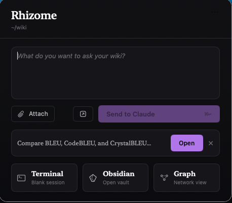
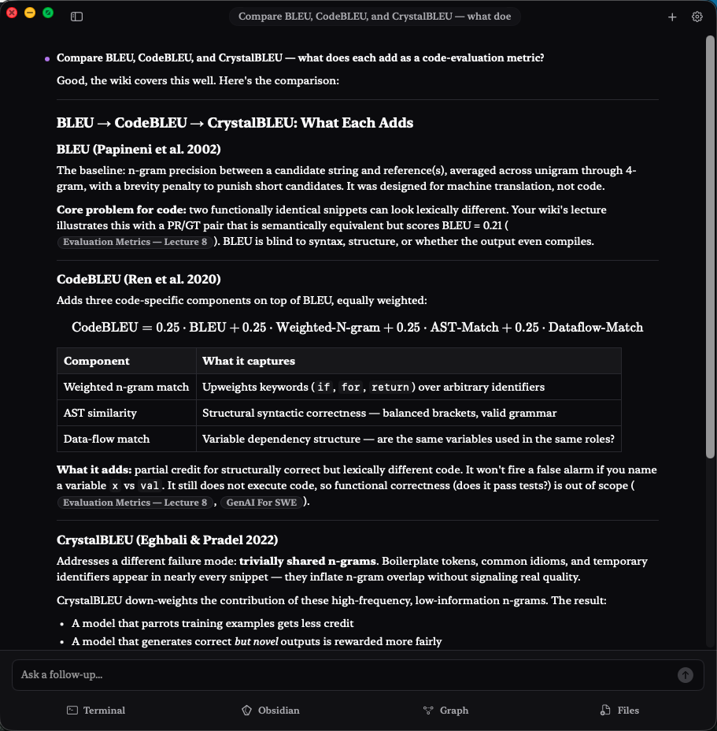

# Rhizome

**Rhizome** is an LLM-maintained personal wiki for Obsidian. You feed it raw sources — PDFs, Notion pages, URLs, stray notes — and Claude does the reading, summarizing, cross-linking, and maintenance. Over time the wiki compounds: every ingested source and every saved answer makes it richer and better connected.

## Rhizome.app — the front door

<p align="center">
  
</p>

The primary way to use Rhizome is **Rhizome.app**, a native macOS menu-bar companion. It gives you:

- **A query window.** Ask a question in plain English; Claude searches your wiki first, cites your own notes with `[[wikilinks]]`, and fills gaps from general knowledge when needed. Answers stream back as markdown tables, mermaid diagrams, and Obsidian callouts — not just paragraphs.
- **Follow-ups with session memory.** Each query thread is a resumable Claude session.
- **One-click shortcuts** to open the vault in Obsidian, jump to the Obsidian graph view, reveal the workspace in Finder, or drop into a Terminal at the workspace root.
- **A bundled CLI sidecar** (`compile-bin`, built with PyInstaller) that handles ingest, synthesis, rendering, and health checks — no separate Python install needed.
- **Auto-installed slash commands** (`/capture`, `/query`, `/context`, `/ingest`, `/lint`, `/synthesize`, `/notion-sync`, …) that Claude Code can invoke from any terminal session against your wiki.

<p align="center">
  
</p>

Under the hood, Rhizome runs `claude -p` as an agentic research session against your workspace. In-app queries allow Bash, local search/read tools, Task subagents, and web search; direct edit/write tools are blocked. Query mode is answer-first: it searches the wiki by default, and it may save or render through `compile` only when you explicitly ask for an artifact or confirm a follow-up save/integration action.

---

## Install

Rhizome.app needs **two things on your Mac before it will work**. Both are required — Rhizome will not function without them.

### 1. Install Obsidian (required)

Rhizome stores everything as plain markdown in an Obsidian vault, and the app's "Open in Obsidian" / "Graph" buttons launch Obsidian directly.

- Download from **[obsidian.md](https://obsidian.md)**.
- Launch it once after installing so macOS registers it.

### 2. Install Claude Code and sign in (required)

Rhizome runs every query through `claude -p`. The CLI must be installed **and authenticated**, or queries will fail immediately.

```bash
npm i -g @anthropic-ai/claude-code
claude                                # complete the sign-in flow once, then quit
```

You only need to authenticate once per machine. If `claude` isn't on your `PATH` after install, restart your terminal.

### 3. Get Rhizome.app

Pick one of these paths. **Option A is recommended** — it skips the Gatekeeper "untrusted app" prompt entirely because the app is built on your machine instead of downloaded.

#### Option A — Build from source (recommended)

This needs two extra developer tools. Install them once:

| Tool | Install |
|---|---|
| Xcode Command Line Tools | `xcode-select --install` |
| [`uv`](https://docs.astral.sh/uv/) | `curl -LsSf https://astral.sh/uv/install.sh \| sh` |

Then:

```bash
git clone <this-repo>
cd rhizome
./scripts/build.sh
cp -R dist/Rhizome.app /Applications/
open /Applications/Rhizome.app
```

`build.sh` produces `dist/Rhizome.app` and launches it for you. Because the app was built locally rather than downloaded, macOS doesn't tag it as quarantined and it opens without the Gatekeeper warning.

#### Option B — Download the prebuilt zip

Faster if you don't want to install Xcode CLT and uv.

1. Grab the latest **`Rhizome.app.zip`** from the [Releases page](../../releases).
2. Unzip it and drag `Rhizome.app` into `/Applications`.
3. **Clear the Gatekeeper quarantine flag** — macOS marks anything downloaded from the internet as untrusted by default. The build is ad-hoc signed but not notarized through Apple's Developer Program, so Gatekeeper will block first launch unless you strip that flag:
   ```bash
   xattr -dr com.apple.quarantine /Applications/Rhizome.app
   open /Applications/Rhizome.app
   ```
   You only need to do this once per install. (Equivalent alternatives: right-click the app → Open, or approve it in System Settings → Privacy & Security after a blocked launch.)

Either way, look for the Rhizome icon in your menu bar (top-right of the screen) once the app is open.

On first launch, Rhizome creates a default workspace at `~/wiki` called "Rhizome" and installs the Claude Code commands that target it.

---

## Your first 5 minutes

1. **Click the Rhizome icon** in your menu bar to open the launcher.
2. **Drop a source.** Drag a PDF, an article URL, or a stray note into the launcher. Rhizome ingests it into `~/wiki/raw/` and creates a source note under `~/wiki/wiki/sources/`.
3. **Ask your first question.** Open the query window and ask something the source you just added can answer. Claude searches your wiki first and cites your own notes with `[[wikilinks]]`.
4. **Click a citation.** Any `[[wikilink]]` in the answer opens that page in Obsidian.
5. **Open the graph.** The graph button visualizes how your sources connect. The first time you use it, Rhizome offers to install the Advanced URI plugin for you with one click.

Add more sources, ask more questions. The wiki compounds.

---

## The Python CLI

`compile` is the tool Claude drives to do the actual work. You can also use it standalone from any terminal:

- `compile init` — scaffold a workspace
- `compile ingest <file>` — register a raw source and create a source note
- `compile obsidian search | page | neighbors` — programmatic wiki reads
- `compile render canvas | marp | chart` — explicit rich-output renderers
- `compile watch add | list | run | tick` — recurring URL pulls synthesized into a wiki page
- `compile eval init | run` — manual headless query eval suites with judge-ready JSON output
- `compile health`, `compile obsidian refresh` — lint and reindex

---

## How it works

Three layers, one contract:

- **`raw/`** — your source documents. Immutable. Claude reads but never edits. PDFs, Notion exports, fetched URLs, pasted notes — all live here.
- **`wiki/`** — the LLM-maintained layer: source notes, articles, maps, outputs. Every page here is grounded in something from `raw/`.
- **`WIKI.md`** — the schema telling Claude how this wiki is structured, what status levels mean, and how to link pages together.

Pages are one of five types: `source` (provenance-anchored, one per raw file), `article` (cross-source synthesis), `map` (navigation hubs), `output` (saved answer, deck, chart, or canvas), and `watch` (a recurring URL pull, see below).

When you ingest a source, the source note embeds the full extracted text in a collapsed `> [!abstract]- Full extracted text` callout, so future queries can grep the real content — not just a synopsis.

### Slash commands

Use these from Rhizome.app or from a Claude Code session launched by the app:

| Command | What it does |
|---|---|
| `/capture` | Drop a thought or snippet into `~/wiki/raw/` and ingest it. Always targets the configured wiki. |
| `/query` | Search the wiki first, then answer any remaining gaps from general knowledge with citations where available. Uses the current workspace, or falls back to the configured wiki. |
| `/context` | Load wiki status, index, overview, and schema into the session. |
| `/ingest [source]` | Register a raw file or URL as a source note. Run from inside the workspace. |
| `/lint` | Audit: broken links, status honesty, dead-end notes, coverage gaps. |
| `/synthesize [theme]` | Connect accumulated sources into articles or maps. |
| `/notion-setup`, `/notion-sync` | Save a Notion scope, then pull matching pages into `raw/notion/`. |
| `/watch-add`, `/watch-review` | Set up an automated URL pull (URL + frequency + plain-language intent), and audit existing watches for staleness or drift. |

You can hand-edit any of these at `<workspace>/.claude/commands/*.md` or `~/.claude/commands/*.md` — open them from Rhizome's Settings → Claude Commands. Your edits survive app restarts.

### MCP server

Rhizome includes a read-only MCP server so Claude Desktop, Claude Code, ChatGPT connectors, and other MCP clients can search and read the wiki through a narrow tool surface.

Available tools:

- `wiki_overview` — workspace status, page counts, graph health, and issue summaries.
- `search_wiki` — search titles, summaries, body text, tags, aliases, and indexed PDF chunks when present.
- `search` — OpenAI connector-compatible alias returning `results` with `id`, `title`, and `url`.
- `read_wiki_page` — read a bounded markdown page by title, alias, wikilink, file name, or relative path.
- `fetch` — OpenAI connector-compatible alias returning a fetched document by search result `id`.
- `page_neighbors` — backlinks, outbound links, related pages, and supporting sources.
- `list_wiki_pages` — page inventory, optionally filtered by type.

The canonical packaged command is `compile-bin mcp`. During repo development, `uv --quiet --directory /path/to/rhizome run rhizome-mcp --workspace /path/to/wiki` is equivalent.

For local MCP clients such as Claude Desktop:

```json
{
  "mcpServers": {
    "rhizome": {
      "command": "/Applications/Rhizome.app/Contents/Resources/compile-bin",
      "args": [
        "mcp",
        "--path",
        "/path/to/wiki"
      ]
    }
  }
}
```

For ChatGPT connector development, run the stateless HTTP transport and expose it through an HTTPS tunnel such as ngrok or Cloudflare Tunnel:

```bash
export RHIZOME_MCP_HTTP_TOKEN="choose-a-long-random-token"
/Applications/Rhizome.app/Contents/Resources/compile-bin mcp \
  --path /path/to/wiki \
  --transport http \
  --host 127.0.0.1 \
  --port 8765 \
  --allow-origin https://chatgpt.com \
  --allow-origin https://chat.openai.com
```

Then register the public tunnel URL ending in `/mcp` in ChatGPT Settings → Connectors → Create.

Security notes:

- The HTTP transport is read-only but can still expose private wiki content. Treat the tunnel URL and bearer token as secrets.
- HTTP requests with an `Origin` header are rejected unless the origin is explicitly allowlisted with `--allow-origin`.
- Non-browser clients may send no `Origin` header, so the bearer token is the real defense for tunneled or remote access.
- Set `RHIZOME_MCP_HTTP_TOKEN` or pass `--http-token` when exposing the server beyond localhost. The server refuses to start unauthenticated HTTP on non-localhost interfaces.
- The HTTP transport is intentionally minimal and stateless: it supports JSON-RPC over POST and single-response SSE, but not resumable sessions or server-initiated notifications.
- `compile mcp` and `rhizome-mcp` accept the same flags; `compile-bin mcp` is the packaged app form.

---

## Watches — automated pulls

A **watch** is a recurring URL pull tuned by a plain-language intent. Each successful run prepends a dated digest to a `watch`-type wiki page; the raw fetched body is archived under `raw/watches/<slug>/<timestamp>.md` so provenance is preserved.

```bash
compile watch add https://www.ft.com/markets \
  --frequency daily \
  --intent "Pull the top 3 stories. For each, give a 2-sentence summary and flag anything related to AI infra capex."
```

- Frequency vocabulary: `hourly`, `daily`, `weekly`, or `cron: <minute> <hour> <dom> <mon> <dow>` (hourly minimum — sub-hour cron is rejected).
- Intent is sent verbatim to Claude as the synthesis instruction. Edit the `watch_intent:` frontmatter field in Obsidian to refine it later.
- After 3 consecutive failures the watch auto-pauses; bring it back with `compile watch resume "<title>"` once you've fixed the URL.
- Unchanged content is detected by hash; the watch records `unchanged` and skips Claude on those ticks.

**Mac users:** Rhizome.app registers a bundled launchd agent (`Rhizome.app/Contents/Library/LaunchAgents/app.rhizome.watch-tick.plist`) via `SMAppService` that runs `compile watch tick` every 15 minutes against the workspace you've selected in the menu bar. Open the **Watches…** window from the menu-bar dropdown to add, run, pause, or remove watches. To disable the schedule, toggle Rhizome off under System Settings → General → Login Items & Extensions.

**Headless / CLI users:** add a cron entry that points at the workspace:

```cron
*/15 * * * * cd /path/to/wiki && /usr/local/bin/compile watch tick >/dev/null 2>&1
```

---

## Troubleshooting

- **Rhizome.app won't open** — `xattr -dr com.apple.quarantine /Applications/Rhizome.app`.
- **Queries fail immediately or with an auth error** — Claude Code isn't installed or isn't signed in. Run `claude` in a terminal, complete sign-in, then try again.
- **"Unable to locate bundled compile-bin"** — re-download the latest release zip, or rebuild from source with `./scripts/build.sh`.
- **"Obsidian is not installed"** — install from [obsidian.md](https://obsidian.md) and reopen.
- **Graph button is disabled** — install the Advanced URI plugin when prompted, then relaunch Obsidian.
- **`compile: command not found` from a slash command** — you ran Claude Code from a terminal Rhizome didn't launch. Start it from the app, or install the CLI standalone: `uv tool install /path/to/this/repo`.

---

## Development

If you followed **Option A** above, you already have everything you need to develop on Rhizome. This section covers the dev-only workflows.

### Syncing template edits with `--update`

```bash
./scripts/build.sh --update
```

Without `--update`, `build.sh` only refreshes the `.app` bundle — your existing wiki keeps the old slash-command and `WIKI.md` templates it was created with.

With `--update`, `build.sh` *also* runs `compile claude setup --force` against `$RHIZOME_DEV_WORKSPACE` (default `~/wiki`), so any edits you've made under `compile/templates/` (slash commands, `WIKI.md`, `.claude/settings.local.json`) are pushed into your live wiki on every rebuild. Use it whenever you're iterating on templates.

Set `RHIZOME_DEV_WORKSPACE=~/some/other/wiki` if your dev wiki lives elsewhere. Set `RHIZOME_SKIP_LAUNCH=1` (or run under `CI`) to skip the post-build app launch.

### Test loop

```bash
uv sync
uv run pytest
uv run compile --help
swift test --package-path Rhizome
```

See [`CLAUDE.md`](CLAUDE.md) for the developer contract (product boundary, module map, release standard).
